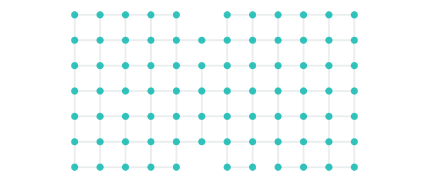

# Presentation — Slides

Each `---` separator is one slide. Slides are intentionally spare:
title + figure/table + a one-line takeaway. Speaker notes live in
`outline.md`; full background is in `prep.md`.

Figure paths are relative to the repo root (`/plots/...`).

---

## Slide 1 — Available AWS hardware



- IonQ, D-Wave, IQM Garnet — unreachable for our region / tenant
- **Accessible**: SV1 (34-qubit state-vector sim) + Rigetti **Ankaa-3** (82-qubit superconducting QPU)
- SV1 = shot-based analytic simulator. Ankaa-3 = real device, grid topology shown above.

> **We ended up with one real QPU (Ankaa-3) and one simulator (SV1) — everything else was blocked.**

---

## Slide 2 — Cost constraints

| Backend | Per task | Per shot |
|---|---:|---:|
| Rigetti Ankaa-3 | **$0.30** | **$0.0009** |
| IQM Garnet (blocked) | $0.30 | $0.00145 |
| SV1 | — | — (per-minute) |

Packed Ankaa-3 cost for our `reservoir_3x3_Z · 1000 shots · 3 ensembles`:

| n_train + n_test | Tasks (packed) | Task $ | Shot $ | **Total** |
|---:|---:|---:|---:|---:|
| 100 + 50 | 24 | $7.20 | $21.60 | **$29** |
| 500 + 250 | 114 | $34.20 | $102.60 | **$137** |
| 1000 + 500 | 225 | $67.50 | $202.50 | **$270** |

> **Budget forces us to run at ≤ 1500 samples and 1000 shots — everything larger becomes prohibitive.**

---

## Slide 3 — Packed execution on Ankaa-3

```
Packing ratio 20  (= 80 of 82 qubits / 4 qubits per reservoir)

  Sample 1 → qubits  0– 3  ┐
  Sample 2 → qubits  4– 7  │  all in ONE Braket task
  …                        │  → 1 per-task fee for 20 samples
  Sample 20 → qubits 76–79 ┘
```

- Pack 20 independent 4-qubit reservoir circuits onto disjoint qubit subsets → **20× fewer API calls** for the same work
- Unpacked alternative costs **~$540** at the n=100+50 scale vs **$29** packed
- Trade-off: more simultaneous active qubits *may* add crosstalk (we test this in slide 9)

> **Packing turns a $540 run into a $29 run by amortising the $0.30 per-task fee — at the cost of 80q active density instead of 4q.**

<sub>*Footnote — a short-lived alternative route via PennyLane parameter broadcasting was abandoned: the plugin collapsed per-observable values within each commuting measurement group, producing impoverished features. Native Braket circuits solve this. Because we had very limited hardware time, early runs used a different (ReservoirAugmenter) circuit than later runs (QuantumReservoir); later experiments switched to the improved augmenter. This is a confounder for slide 9.*</sub>

---

## Slide 4 — Headline results

Reservoir 3×3 Z — Ridge test MSE

| Method | n_feat | n_aug | n_tr | n_te | **MSE** | Δ vs raw | % change | resid μ | resid σ |
|---|---:|---:|---:|---:|---:|---:|---:|---:|---:|
| Raw only | 4 | 0 | 100 | 50 | **5.81** | — | — | −0.48 | 2.36 |
| Noiseless sim | 16 | 12 | 100 | 50 | **2.84** | −2.96 | **−51 %** | −0.01 | 1.69 |
| Rigetti 1000 shots | 16 | 12 | 100 | 50 | **5.46** | −0.35 | **−6 %** | −0.43 | 2.30 |
| Raw only | 4 | 0 | 500 | 250 | **4.13** | — | — | +0.24 | 2.02 |
| Noiseless sim | 16 | 12 | 500 | 250 | **2.00** | −2.13 | **−52 %** | 0.00 | 1.41 |
| Rigetti 1000 shots | 16 | 12 | 500 | 250 | **4.07** | −0.06 | **−1 %** | +0.22 | 2.01 |
| Raw only | 4 | 0 | 1000 | 500 | **5.66** | — | — | −0.29 | 2.36 |
| Noiseless sim | 16 | 12 | 1000 | 500 | **2.59** | −3.08 | **−54 %** | −0.24 | 1.59 |
| Rigetti 1000 shots | 16 | 12 | 1000 | 500 | **5.43** | −0.23 | **−4 %** | −0.35 | 2.30 |

> **Ideal simulator halves the MSE (~52 % gain). Real hardware captures ≤ 6 % of that gain.**

---

## Slide 5 — \[placeholder\] MSE visualisation

> **TODO — replace `mse_vs_features.png` / `mse_vs_training_size.png` with a more informative chart (grouped bar by method × size).**

Candidate: 3×3 grouped bar chart, x = data size (100, 500, 1000), grouped by
method (raw / exact / Rigetti), y = Ridge test MSE. Should make the "half
the gap stays closed after adding hardware" story visually immediate.

---

## Slide 6 — Per-feature fidelity over data size


- 12 augmented features, one line per (reservoir × qubit) pair
- x-axis = training size, y-axis = Pearson correlation with exact simulator
- Dashed green at r = 1 is perfect fidelity

> **Most features sit in 0.1–0.5. Two features (res 1·q0, res 2·q0) are consistently above 0.4 — partial survivors.**

---

## Slide 7 — Per-measurement scatter (packed hardware vs exact)


- Pooled over all augmented features × all samples: 1800 → 9000 → 18000 points
- Dashed line = y = x (perfect agreement)
- Pooled r labelled on each panel

> **Scatter cloud is the same shape at every data size — noise is per-circuit, not averaged away by more samples.**

---

## Slide 8 — Error distribution and the shot-noise floor


- SV1 run (green) = state-vector sim with 1000-shot sampling only — no other noise
- SV1 sits tight on the analytic shot-noise floor at 0.030
- All Rigetti histograms (singleton + packed × 2 sizes) peak 5–7× higher and have a heavy right tail

> **Only ~15 % of Rigetti's error budget is shot noise. The remaining ~85 % is gate + readout + crosstalk.**

---

## Slide 9 — Three-way overlay: does packing hurt fidelity?


- **Singleton** (mauve): 4 active qubits per task · mean \|err\| = 0.200 · r = 0.32
- **Packed** (coral): 80 active qubits per task · mean \|err\| = 0.210 · r = 0.39
- Both clouds hug y = x with comparable spread

> **No measurable density-crosstalk — 80q packed ≈ 4q singleton on per-measurement error.**

<sub>*Caveat — singleton (from earlier `ReservoirAugmenter` circuit, Z+ZZ observables) and packed (later `QuantumReservoir` circuit, Z only) use different reservoir implementations because time pressure forced an early Rigetti run before we finalised the improved augmenter. Confounders: circuit family + observable mix — annotated in the figure.*</sub>

---

## Slide 10 — Noise-model calibration (Analysis 1)


Fit `R = λ·E + shot_noise(N=1000) + 𝒩(0, σ_g²)` on pooled (exact, hardware) pairs:

| Source | λ (damping) | σ_g (gate) | r observed | r modelled |
|---|---:|---:|---:|---:|
| SV1 | **1.001** | **0.000** | 0.994 | 0.994 |
| Singleton 4q | **0.207** | **0.150** | 0.322 | 0.326 |
| Packed 80q (pooled) | **0.258** | **0.159** | 0.337 | 0.376 |

> **Rigetti behaves like exact sim × 0.25 + Gaussian(σ=0.15). SV1 self-check recovers (λ=1, σ_g=0) exactly → the fit is trustworthy.**

---

## Slide 11 — Mitigation study (Analysis 2)


Tried: `hw_quantum_only`, `hw_damping_corrected` (×1/λ), `hw_top{1,2,4,8,all}`
by per-feature train-set correlation — against raw-only floor and exact
ceiling.

- Hardware features alone → **MSE 27–35** (unusable without raw)
- Best top-k selection matches `hw_baseline` — Ridge's CV already does the same thing
- Damping inversion helps once (packed n=100+50, 5.46 → 4.64), nowhere else

> **No classical post-processing meaningfully recovers the lost signal. Mitigation must happen at the quantum-circuit level (ZNE / PEC / DD).**

---

## Slide 12 — Matched noise injection (Analysis 4)


Inject `𝒩(0, σ²)` into *exact-sim* quantum features; find σ* that matches
observed Rigetti MSE:

| Source | n_train | hw MSE | **σ*** |
|---|---:|---:|---:|
| singleton_z+zz | 100 | 5.51 | **0.42** |
| packed_z | 100 | 5.46 | **0.46** |
| packed_z | 500 | 4.07 | **0.59** |
| packed_z | 1000 | 5.43 | **0.62** |

> **In one number: Rigetti ≈ exact sim + Gaussian noise of σ ≈ 0.5. σ* grows with n_train — because Ridge regularises away noisy features more effectively with more data.**
